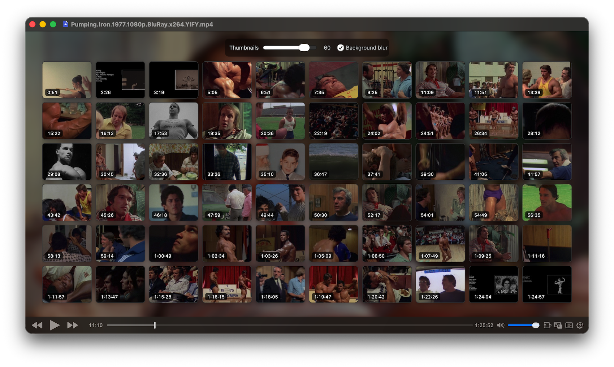

# Thumbnails for IINA

An IINA plugin that shows clickable thumbnails for each video.

## Features

- Browse a video with a grid of thumbnails.
- Click any thumbnail to jump to that point in the video.
- Choose 10, 15, 20, 30, 40, 60, or 100 thumbnails.
- The thumbnail controls stay fixed while the grid rearranges.
- Optional background blur.
- Thumbnails use IINA's native thumbnail cache.
- The grid updates while the IINA window is resized.

## Install

### From IINA

Open **IINA → Settings → Plugins → Install from GitHub…** and enter:

`aminozuur/iina-thumbnails`

### From a release package

Download the latest `.iinaplgz` file from the [Releases](https://github.com/aminozuur/iina-thumbnails/releases) page and install it in IINA.

## Permissions

Thumbnails requires these IINA permissions:

- **Access the file system** — reads IINA's native thumbnail cache.
- **Add overlays on videos** — displays the thumbnail grid and controls over the video.

## Author

**Amin Eftegarie**  
Email: [amin@eftegarie.com](mailto:amin@eftegarie.com)  
Website: [eftegarie.com](https://eftegarie.com/)

## License

No open-source license has been selected yet.
